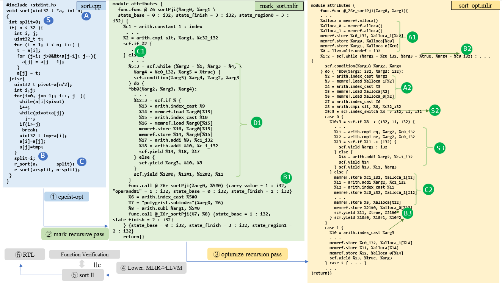
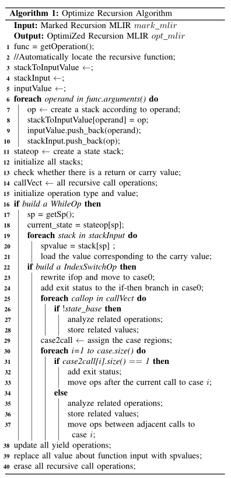

## Optimize Recursion Pass

We present an optimization example (fast sort). And we describe the optimization details in combination with the algorithm.

Quicksort, is highly efficient thanks to its divide-and-conquer approach. We'll focus on enhancing its performance through techniques like better pivot selection and minimizing unnecessary comparisons. By optimizing quick sort, we aim for faster sorting times and improved resource usage. 

 

The figure (*C* and *B1*) shows the recursive calls, the marked recursive states, and the carrying value. The state will indicate the region where we assign the recursion, `$state_base$` means the case in which we start, and `$state_finish$` means the case in which we finish. As we can see, the variable *split (S and B)* is assigned a value before the call. In MLIR we see that the code (*C1*) has a return value `%5#0`, which is used as input to call (*B1*). Therefore we analyze the number and location of the carrying values to avoid errors.

 

To begin with, we can automatically find the recursive function that needs to be processed without specifying a recursive function name since MLIR may have multiple functions (lines 1-2). Then we need to create stacks for all the parameters of the function (A) and initialize some containers to store this stack information (**A1**) (lines 3-10). Since recursion keeps jumping, we also create a stack for the state and initialize it (lines 11-12). At the same time, determine if there are any carrying values or return values; we need to load/return the corresponding values in subsequent optimizations (lines 13, 21). Storing all recursive calls is to assign state in order (line 14). To build `whileop` and `indexswitchop`, we should follow the rules of MLIR to initialize the corresponding types and values (**B2**), which are `sp` (the depth of the recursive call), `while` (whether to break the loop), and `return` (if available). Having successfully built the while loop to simulate recursion, we need to load the recursion active state desired for the current level (`sp`), which corresponds to code **A2** in the fig. \ref{recursionmlirexp} (lines 17-21). When building the `indexswitchop` to implement a state machine, **S2** determines the branches that are executed in the loop body (line 22).

We need to rewrite `ifop`: 
1) the body of case0 is composed of the if-else region of the marked MLIR **(C1)** and add the exit state operations at the end of the if-then region **S3**; 
2) analyze the recursive operations of `state_base=0` and store the relevant active values (**C2**) (lines 23-28). 

Next, we need to analyze the state of all recursive calls to assign regions to them (line 29). For the different cases, if they only have a single recursive call (typically the last case), we add an exit state similar to **S3**. Otherwise, if there are multiple recursive calls, we analyze the relevant operations, store the active values required for the next call (**B3**), and move the operations to the case region (lines 30-37). We update all yield operations and replace all function arguments with the required active variables (A2) to ensure the program's legality (lines 38-39). Eventually, all recursive calls are erased to output an optimized MLIR based on the state machine (line 40).
